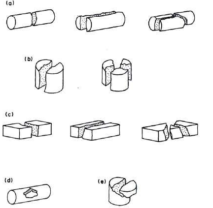
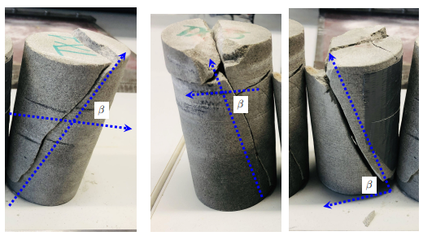
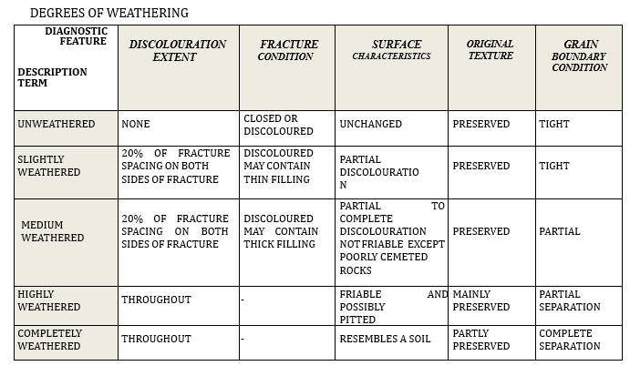

## 1.	The definitions of weathering are as follows:
#### Unweathered -
No visible signs of alteration in the rock material out fracture planes may be stained or discoloured.
#### Slightly weathered -
Fractures are stained or discoloured and may contain a thin filling of altered material. Discolouration may extend into the rock from the fracture planes to a distance of up to 20% of the fracture spacing (i.e. less than 4o% of the core is discoloured).
#### Medium weathered -
Slight discolouration extends from fracture planes for a distance greater than 20% of the fracture spacing (i.e. generally greater part of the rock). Fractures may contain filling of altered material. The surface of the core is not friable (except in the case of poorly cemented sedimentary rocks) and the original texture of the rock has been preserved. Partial opening of grain boundaries may be observed.
#### Highly weathered -
Discolouration extends throughout the rock. The surface of the core is friable and usually pitted due to washing out of highly altered minerals by drilling water. The original texture of the rock has mainly been preserved but separation of grains has occurred.
#### Completely weathered -
The rock is totally discoloured and the external appearance of the core is that of a soil. Internally the rock texture is partly preserved but grains have completely separated.
